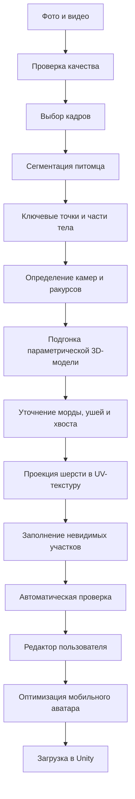
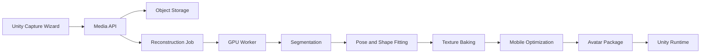

# 3D-реконструкция виртуального питомца для Unity

## Техническая концепция

**Статус:** исследовательская и архитектурная спецификация
**Назначение:** создание узнаваемого анимированного 3D-питомца по фотографиям, видео и описаниям пользователя
**Целевая среда:** мобильное Unity-приложение для iOS и Android

## Согласованный первый инженерный этап

Первый этап проекта — не полноценное мобильное приложение, а отдельная сквозная система реконструкции одного тестового животного, на котором будет отрабатываться весь pipeline.

### Вход

- Несколько фотографий одной собаки.
- Фотографии могут быть неполными, иметь недостаточно ракурсов или не показывать отдельные части тела.
- Недостаток материалов не блокирует обработку.
- Система предупреждает, что невидимые участки будут приблизительными, после чего ИИ самостоятельно достраивает отсутствующую геометрию и текстуру.
- Ответственность за визуальную точность при недостатке исходных фотографий принимает пользователь.

### Обработка

Система должна автоматически:

1. Проверить и сгруппировать фотографии.
2. Выделить собаку на каждом изображении.
3. Определить доступные ракурсы и анатомические ориентиры.
4. Подогнать параметрическую модель собаки.
5. Достроить невидимые части тела.
6. Создать текстуру окраса и заполнить отсутствующие участки.
7. Привязать модель к стандартному скелету.
8. Проверить модель на базовой тестовой анимации.
9. Оптимизировать геометрию и текстуры для Unity.
10. Сформировать готовый переносимый артефакт.

### Выход

Минимальный результат этапа:

```text
pet.glb
albedo.png или albedo.ktx2
normal.png или normal.ktx2
avatar.json
preview.png
```

Файл `pet.glb` должен содержать:

- mesh собаки;
- скелет;
- skin weights;
- UV-развёртку;
- материалы;
- при возможности одну встроенную тестовую анимацию.

### Unity Viewer

Вместе с reconstruction-pipeline создаётся минимальный Unity-проект, который позволяет:

1. Выбрать или скачать готовый пакет питомца.
2. Загрузить `pet.glb`.
3. Создать объект питомца в сцене.
4. Проверить материалы и текстуры.
5. Повернуть камеру вокруг модели.
6. Запустить тестовую анимацию ожидания или ходьбы.
7. Убедиться, что скелет и деформации работают корректно.

### Формат поставки

Основной результат reconstruction-сервиса — независимый от платформы GLB-пакет. Это позволяет использовать один результат в Unity Editor, Android и iOS без повторной 3D-реконструкции.

Дополнительно можно создать Unity-конвертер:

```text
GLB-пакет → импорт в Unity → prefab → Addressable или AssetBundle
```

`.unitypackage` подходит для ручного импорта инструментов и тестовых assets в Unity Editor, но не является основным runtime-форматом питомца. AssetBundle подходит для runtime-загрузки готового prefab, однако собирается отдельно для каждой целевой платформы. Unity прямо указывает, что AssetBundles содержат платформенно-зависимые assets и должны быть построены под соответствующий target.

### Definition of Done

Первый этап завершён, когда:

1. Система принимает заранее выбранный набор фотографий тестовой собаки.
2. Обработка выполняется автоматически без ручной работы 3D-художника.
3. При отсутствии ракурсов система достраивает результат, а не останавливается.
4. На выходе появляется валидный rigged GLB-пакет.
5. Модель открывается в тестовом Unity-проекте.
6. Материалы и окрас отображаются корректно.
7. Скелет деформирует модель без критических разрывов.
8. Проигрывается как минимум одна тестовая анимация.
9. Повторный запуск pipeline воспроизводим и создаёт версионированный результат.
10. Ограничения и известные ошибки зафиксированы для следующей итерации.

## 1. Рекомендуемое техническое решение

Не следует генерировать произвольную 3D-модель питомца с нуля. Для production-системы надёжнее подгонять под конкретного питомца заранее подготовленную анатомически корректную и уже анимированную параметрическую модель.

Итоговый питомец состоит из следующих слоёв:

```text
базовая модель вида
+ индивидуальная форма тела
+ параметры головы, морды, ушей и хвоста
+ персональная текстура шерсти
+ зоны длины и пушистости шерсти
+ общий скелет и skin weights
+ библиотека анимаций
+ подтверждённые особенности питомца
```

Такой подход обеспечивает:

- предсказуемую анатомию;
- совместимость со стандартной Unity-анимацией;
- стабильную работу на мобильном устройстве;
- возможность использовать общую библиотеку движений;
- контролируемый размер загружаемого аватара;
- понятный пользовательский редактор;
- возможность постепенно улучшать reconstruction-pipeline.

## 2. Ограничение исходных материалов

Точную 3D-копию невозможно получить из обычных семейных фотографий, если на них не видны все стороны питомца. ИИ неизбежно будет достраивать:

- спину, если она не показана;
- противоположную сторону морды;
- живот и внутреннюю сторону лап;
- форму груди;
- точную длину и форму хвоста;
- рисунок шерсти в невидимых местах.

Поэтому система должна различать три уровня происхождения результата:

1. **Подтверждённый участок:** хорошо виден на исходных материалах.
2. **Приблизительно восстановленный участок:** выведен из нескольких частичных ракурсов.
3. **Сгенерированный участок:** отсутствовал в материалах и восстановлен по общим признакам.

Для каждого участка модели должна сохраняться confidence map. Пользователь видит степень достоверности и может исправить приблизительные или сгенерированные зоны.

## 3. Входные сценарии

### 3.1. Управляемое сканирование живого питомца

Приложение проводит пользователя через мастер съёмки:

1. Снять питомца слева.
2. Снять питомца справа.
3. Снять спереди и сзади.
4. Записать медленный круговой ролик.
5. Отдельно снять морду, уши, лапы и хвост.
6. По возможности снять питомца стоящим.
7. Проверить, что человек, мебель и одежда не перекрывают тело.

Мастер должен анализировать качество в реальном времени и подсказывать:

- подойти ближе;
- уменьшить движение камеры;
- добавить света;
- снять недостающую сторону;
- повторить размытый фрагмент;
- убрать перекрывающий объект.

### 3.2. Архивные материалы

Для умершего питомца используются любые сохранившиеся фото и видео. Система автоматически:

- извлекает кадры из видео;
- удаляет размытые и почти одинаковые кадры;
- определяет доступные ракурсы;
- оценивает видимость частей тела;
- группирует материалы по качеству;
- сообщает, каких данных не хватает;
- прогнозирует качество результата до запуска обработки.

Пример сообщения пользователю:

> Левая сторона и морда восстановлены с высокой уверенностью. Вид спереди отсутствует. Форма груди и рисунок правой лапы будут приблизительными.

## 4. Общий reconstruction-pipeline



Тяжёлая реконструкция выполняется на GPU-сервере. Телефон отвечает за загрузку материалов, проверку съёмки, редактирование и отображение готового результата.

## 5. Предварительная обработка

### 5.1. Выбор кадров

Из видео извлекаются кадры, после чего для каждого оцениваются:

- резкость;
- освещение;
- размер питомца в кадре;
- наличие перекрытий;
- положение камеры;
- видимость морды, корпуса, лап и хвоста;
- сходство с уже выбранными кадрами.

В дальнейшую обработку направляется компактный набор качественных и различающихся ракурсов. Это уменьшает стоимость GPU-обработки и снижает влияние плохих кадров.

### 5.2. Сегментация

Для каждого кадра создаются две маски:

- строгая маска тела для подгонки геометрии;
- мягкая alpha-маска шерсти для реконструкции внешнего контура и текстуры.

Разделение необходимо потому, что полупрозрачные края длинной шерсти плохо подходят для точной оценки физического объёма тела.

### 5.3. Определение анатомии

Модель определяет:

- глаза и нос;
- основание и концы ушей;
- плечи и бёдра;
- локти и колени;
- лапы;
- основание и конец хвоста;
- контур корпуса;
- семантические области тела.

Кроме отдельных ключевых точек желательно использовать dense correspondences: соответствия между областями фотографии и участками поверхности параметрической модели.

## 6. Параметрическая модель

Для каждого поддерживаемого вида создаётся мастер-модель с постоянной топологией:

- единый mesh;
- единая UV-развёртка;
- общий скелет;
- стандартные веса костей;
- набор морфов тела;
- отдельные морфы головы и морды;
- сменные варианты ушей и хвоста;
- зоны короткой, средней и длинной шерсти.

Исследовательской основой подхода является семейство SMAL-подобных параметрических моделей животных. Подобная модель используется в исследованиях BARC, Animal Avatars и 4D-Animal.

Перед коммерческим использованием необходимо отдельно проверить лицензии исходных моделей, кода и обучающих данных. Исследовательские реализации нельзя автоматически считать разрешёнными для production-продукта. При необходимости создаётся собственная параметрическая модель на лицензированных 3D-данных.

### 6.1. Параметры формы

Пример минимального набора:

```text
body_length
body_height
chest_width
belly_volume
leg_length_front
leg_length_back
paw_scale
neck_length
head_width
muzzle_length
muzzle_width
ear_length
ear_fold
eye_spacing
tail_length
tail_thickness
tail_curve
```

ИИ не создаёт новую топологию для каждого пользователя. Он вычисляет параметры, после чего мастер-модель деформируется предсказуемым способом.

### 6.2. Отдельные модели видов

Не следует пытаться охватить всех животных одной универсальной моделью. Для MVP нужны отдельные контуры:

- собака;
- кошка.

В дальнейшем можно добавлять новые виды отдельными пакетами с собственной анатомией, скелетом, формами и библиотекой анимаций.

## 7. Подгонка формы

Для всех кадров одного питомца одновременно оптимизируются:

- единая форма конкретного питомца;
- положение и параметры камеры каждого кадра;
- поза питомца на каждом кадре;
- масштаб;
- параметры головы, ушей и хвоста.

Концептуальная целевая функция:

```text
Loss =
    silhouette_loss
  + keypoint_loss
  + dense_correspondence_loss
  + multi_view_consistency
  + temporal_consistency
  + shape_prior
  + breed_prior
  + symmetry_prior
  + anatomical_constraints
```

Компоненты:

- `silhouette_loss` совмещает контур модели и фотографии;
- `keypoint_loss` совмещает суставы и анатомические точки;
- `dense_correspondence_loss` связывает пиксели с поверхностью mesh;
- `multi_view_consistency` требует одну и ту же форму на разных ракурсах;
- `temporal_consistency` стабилизирует результат между кадрами видео;
- `shape_prior` ограничивает маловероятные формы;
- `breed_prior` учитывает типичные породные пропорции;
- `symmetry_prior` используется только как мягкое предположение;
- `anatomical_constraints` предотвращает невозможные суставы и пропорции.

Порода не должна жёстко определять результат: метисы и отдельные животные могут значительно отличаться от породного среднего.

## 8. Морда как отдельная подсистема

Люди прежде всего узнают питомца по морде. Общей подгонки корпуса недостаточно, поэтому морда обрабатывается отдельно.

Процесс:

1. Выбрать крупные фронтальные и боковые изображения.
2. Определить контур головы.
3. Измерить расположение глаз и носа.
4. Подобрать форму головы и морды.
5. Подогнать длину носа и ширину челюсти.
6. Выбрать форму и положение ушей.
7. Восстановить характерные пятна.
8. Сравнить рендер с исходными фотографиями.
9. Передать результат в отдельный пользовательский редактор.

Редактор морды показывает фотографию и 3D-модель рядом. Желательны синхронное вращение, наложение контура и переключение между исходными ракурсами.

## 9. Создание окраса

Текстура часто влияет на узнаваемость сильнее небольшой ошибки формы. Белое пятно на морде, тёмное ухо, цвет лап или полосы должны воспроизводиться максимально точно.

### 9.1. Проекция фотографий

Каждая видимая точка изображения проецируется на UV-развёртку мастер-модели.

Для каждого texel выбираются пиксели, у которых:

- поверхность направлена к камере;
- участок не перекрыт;
- кадр достаточно резкий;
- нет сильного блика или тени;
- цвет согласуется с соседними ракурсами.

Несколько проекций смешиваются в единую текстуру с учётом качества и угла наблюдения.

### 9.2. Нормализация освещения

Исходный цвет нельзя напрямую запекать в текстуру: вместе с шерстью в неё попадут тени, блики и цвет окружающего освещения.

Необходимо приблизительно разделить:

```text
видимый цвет = собственный цвет шерсти × освещение
```

Результатом должна быть нейтральная albedo-текстура, которую затем освещает Unity.

### 9.3. Невидимые зоны

Для отсутствующих частей применяется генеративное заполнение с ограничениями:

- симметрия используется только как начальное предположение;
- подтверждённые цвета и отметины блокируются от изменений;
- генерация не должна затрагивать достоверные зоны;
- каждый сгенерированный участок отмечается в confidence map;
- пользователь может перекрасить участок вручную.

## 10. Шерсть

Полноценную физически симулируемую шерсть для мобильного MVP использовать не следует.

Рекомендуемая реализация:

- базовая поверхность с albedo и normal map;
- маска длины шерсти;
- карточки шерсти на ушах, груди и хвосте;
- несколько shell-слоёв для пушистых пород;
- упрощённый shader для слабых устройств;
- улучшенный shader для производительных устройств.

В профиле питомца сохраняются параметры зон шерсти:

```text
length
density
direction
tip_color
roughness
fluffiness
```

## 11. Почему NeRF и Gaussian Splatting не должны быть конечным форматом

NeRF и Gaussian Splatting могут хорошо воспроизводить внешний вид объекта с известных ракурсов, но виртуальный питомец должен:

- ходить;
- садиться;
- ложиться;
- поворачивать голову;
- взаимодействовать с предметами;
- корректно деформироваться;
- использовать библиотеку игровых анимаций;
- работать на мобильном GPU.

Нейронные и splat-представления сложнее корректно анимировать и оптимизировать для такого сценария. Их можно использовать как промежуточный визуальный эталон или источник дополнительных ракурсов, но итогом должен быть обычный rigged mesh.

## 12. Скелет и анимация

Главное преимущество общей параметрической модели — готовый скелет. Вместе с формой наследуются:

- кости;
- skin weights;
- ограничения суставов;
- IK лап;
- точки контакта;
- корректирующие blend shapes;
- библиотека анимаций.

Все питомцы одного вида используют общие анимации:

- стоять;
- идти;
- бежать;
- садиться;
- лежать;
- спать;
- потягиваться;
- вилять хвостом;
- чесаться;
- играть;
- реагировать на прикосновение.

Позже индивидуальные движения из видео можно преобразовывать в поправки к базовым анимациям:

```text
базовая походка
+ длина шага
+ скорость
+ вертикальное движение корпуса
+ наклон головы
+ стиль движения хвоста
```

## 13. Пользовательский редактор

Полностью автоматическая выдача результата слишком рискованна. Пользовательская проверка является обязательным этапом.

### 13.1. Пропорции

- рост;
- длина корпуса;
- размер головы;
- длина лап;
- телосложение;
- длина и форма хвоста.

### 13.2. Морда

- положение и размер глаз;
- размер носа;
- форма ушей;
- длина морды;
- форма щёк.

### 13.3. Окрас

- основной цвет;
- пятна;
- полосы;
- белые участки;
- цвет лап, ушей и хвоста.

### 13.4. Шерсть

- короткая или длинная;
- пушистость груди;
- пушистость хвоста;
- шерсть на ушах;
- общий объём контура.

Редактор должен предлагать крупные понятные варианты и простые кисти. Пользователь не должен осваивать профессиональное 3D-моделирование.

## 14. Уровни качества

| Уровень | Исходные материалы | Ожидаемый результат |
| --- | --- | --- |
| **Базовый** | 1–3 фотографии | Стилизованный похожий питомец; значительная часть формы приблизительна |
| **Хороший** | 8–20 разных фотографий | Узнаваемая форма, морда и окрас |
| **Высокий** | Фотографии и несколько видео | Более точные пропорции и покрытие текстуры |
| **Управляемое сканирование** | Специально снятый круговой ролик и крупные планы | Максимально точный доступный результат |

Прогноз уровня качества показывается до запуска тяжёлой обработки.

## 15. Формат готового аватара

Серверный pipeline выпускает версионированный пакет:

```text
pet.glb
albedo.ktx2
normal.ktx2
fur_mask.ktx2
confidence_map.ktx2
avatar.json
preview.webp
```

GLB используется как переносимый контейнер для геометрии, скелета, skin weights и материалов. Unity загружает пакет, проверяет версию, сохраняет его в кэше и создаёт обычный `SkinnedMeshRenderer`.

Пример метаданных:

```json
{
  "avatarVersion": 1,
  "species": "dog",
  "baseModel": "dog_v3",
  "skeleton": "dog_standard_v2",
  "qualityTier": "good",
  "shapeConfidence": 0.82,
  "textureCoverage": 0.74,
  "generatedCoverage": 0.26
}
```

## 16. Начальные мобильные бюджеты

Для первого технического прототипа:

- 15–30 тысяч треугольников для основной модели;
- один основной skinned mesh;
- 1–2 дополнительных mesh-слоя шерсти;
- текстура 2048×2048 для близкого плана;
- текстура 1024×1024 для слабых устройств;
- не более 2–3 материалов;
- LOD для среднего и дальнего расстояния;
- общий скелет для всех питомцев одного вида;
- ориентир размера пакета до 20–30 МБ;
- стабильные 30 FPS на минимальном целевом устройстве.

Это стартовые бюджеты. Они должны подтверждаться профилированием на реальных целевых устройствах.

Unity поддерживает сжатие mesh-данных, но указывает на дополнительные затраты при распаковке и риск артефактов. Уровень сжатия необходимо проверять на конкретной модели и устройстве.

## 17. Серверная архитектура



Предлагаемое разделение технологий:

- **Unity/C#:** мастер съёмки, редактор и отображение;
- **backend API:** создание заданий, авторизация и контроль статуса;
- **PostgreSQL:** состояние обработки и метаданные;
- **объектное хранилище:** исходные и производные файлы;
- **Python/PyTorch GPU workers:** реконструкция;
- **очередь заданий:** длительные GPU-операции;
- **GLB/KTX2:** доставка готового аватара.

Небольшие модели оценки качества или классификации можно запускать на устройстве через Unity Sentis. Полная 3D-реконструкция остаётся серверной задачей.

## 18. Состояния задания

Рекомендуемый жизненный цикл:

```text
uploaded
→ validating
→ needs_more_media | queued
→ segmenting
→ fitting_shape
→ fitting_face
→ baking_texture
→ optimizing
→ awaiting_user_review
→ approved
→ published
```

Ошибки не должны приводить к потере исходных данных. Пользователь получает конкретное объяснение и может заменить только проблемные материалы.

## 19. Технический прототип

До разработки полного приложения нужен отдельный reconstruction spike.

### 19.1. Минимальный объём

- один вид животного;
- одна параметрическая мастер-модель;
- один общий скелет;
- 10 тестовых питомцев;
- серверная подгонка формы;
- проекция текстуры;
- confidence map;
- простой редактор пропорций и окраса;
- просмотр результата в Unity;
- несколько базовых анимаций.

### 19.2. Проверочный набор

- разные породы и типы телосложения;
- короткая и длинная шерсть;
- светлый, тёмный и пятнистый окрас;
- хорошие и плохие архивные материалы;
- специально снятые круговые видео;
- частично закрытые ракурсы;
- метисы и животные без явной породы.

### 19.3. Критерии успеха

1. Владелец узнаёт своего питомца без подписи.
2. Морда и основные отметины принимаются без полной переделки.
3. Исправление результата занимает несколько минут, а не профессиональную ручную работу.
4. Модель корректно выполняет базовые анимации.
5. Лапы устойчиво контактируют с поверхностью.
6. Шерсть не создаёт критических мобильных артефактов.
7. Аватар укладывается в бюджет памяти, размера и FPS.
8. Система обнаруживает недостаточные материалы и не скрывает низкую уверенность.
9. Повторная обработка не изменяет подтверждённые пользователем участки без разрешения.

## 20. Основные риски

| Риск | Последствие | Снижение риска |
| --- | --- | --- |
| Недостаточно ракурсов | Неверная форма и выдуманный окрас | Прогноз качества, confidence map и пользовательский редактор |
| Ошибка сегментации шерсти | Искажённый силуэт | Раздельные маски тела и шерсти |
| Неверная поза на фото | Ошибка пропорций | Совместная оптимизация нескольких кадров |
| Эффект «зловещей долины» | Эмоциональное отторжение | Стилизация и ограниченный уровень реализма |
| Неверная морда | Питомец не узнаётся | Отдельная модель и отдельный редактор морды |
| Слишком тяжёлый аватар | Низкий FPS и большой пакет | Общая топология, LOD, KTX2 и мобильные бюджеты |
| Исследовательская лицензия | Нельзя выпустить коммерческий продукт | Собственная или коммерчески лицензированная модель и данные |
| Нестабильный автоматический pipeline | Высокая стоимость ручной поддержки | Ограниченный MVP и чёткие причины отказа |

## 21. Что не рекомендуется

- Обещать точную копию из одной фотографии.
- Использовать полностью свободную генерацию mesh без анатомического шаблона.
- Делать NeRF или Gaussian Splatting основным анимируемым форматом.
- Запускать тяжёлую реконструкцию непосредственно на телефоне.
- Скрывать сгенерированные участки от пользователя.
- Создавать отдельный скелет и новые skin weights для каждого питомца без необходимости.
- Добавлять много видов животных до стабилизации кошки или собаки.
- Строить MVP вокруг фотореалистичной физической шерсти.

## 22. Итоговое решение

Для MVP рекомендуется следующий pipeline:

> SMAL-подобная параметрическая модель + multi-view fitting + отдельная реконструкция морды + UV-проекция окраса + confidence map + пользовательский редактор + общий мобильный скелет.

Реалистичное продуктовое обещание:

> Приложение создаст узнаваемого анимированного питомца по вашим материалам, покажет приблизительно восстановленные места и позволит легко довести сходство вручную.

Первым инженерным шагом должен быть reconstruction spike: один вид животного, одна мастер-модель, 10 тестовых питомцев, серверная подгонка формы и текстуры, после чего результат проверяется и анимируется в Unity.

## 23. Источники и технические ориентиры

- [BARC: 3D Dog Reconstruction from Images](https://link.springer.com/article/10.1007/s11263-023-01780-3)
- [BARC: Max Planck Institute publication page](https://is.mpg.de/ps/publications/barc-ijcv-2023)
- [Animal Avatars: Reconstructing Animatable 3D Animals from Casual Videos](https://discovery.ucl.ac.uk/id/eprint/10204221)
- [4D-Animal: Freely Reconstructing Animatable 3D Animals from Videos](https://arxiv.org/abs/2507.10437)
- [MagicPony: Learning Articulated 3D Animals in the Wild](https://arxiv.org/abs/2211.12497)
- [Unity Sentis](https://docs.unity3d.com/jp/current/Manual/com.unity.ai.inference.html)
- [Unity Mesh Compression](https://docs.unity3d.com/jp/current/Manual/configure-mesh-compression.html)

Перечисленные исследования подтверждают техническую реализуемость отдельных частей pipeline, но не являются готовым коммерческим сервисом. Лицензии, датасеты, качество на пользовательских материалах и мобильные бюджеты необходимо проверять отдельным прототипом.

## 24. Реализованный интеграционный прототип

В репозитории создан изолированный прототип первого этапа:

- Web UI принимает от 1 до 20 фотографий собаки;
- локальный API создаёт фоновое задание и сообщает прогресс;
- reconstruction provider формирует ригованную модель `pet.glb`, текстуры, manifest и preview;
- результат скачивается как `pet-avatar.zip`;
- Unity Viewer распакованной модели создаёт `SkinnedMeshRenderer`, иерархию костей и тестовое движение хвоста.

Исходный код и инструкция запуска находятся в
`PetCemeteryUnityApp/PetAvatarPrototype/README.md`. Unity-часть находится в
`PetCemeteryUnityApp/My project (1)/Assets/PetAvatarPrototype/`.

### Граница текущей реализации

Встроенный provider `procedural-prototype` проверяет полный технический контракт,
но не является AI-реконструкцией внешности. Он создаёт процедурную низкополигональную
собаку с общим скелетом; цвет и часть пропорций детерминированно зависят от входных
фотографий. Поэтому текущий результат нельзя оценивать по критерию узнаваемости
конкретного питомца.

Следующий этап — заменить provider реализацией multi-view fitting и восстановления
текстуры, сохранив уже работающие Web UI, API заданий, ZIP-контракт и Unity Viewer.
До выбора модели необходимо отдельно подтвердить лицензию весов и датасетов,
качество на реальных фотографиях и вычислительный бюджет.

### Проверенный контракт артефакта

```text
pet-avatar.zip
├── pet.glb
├── textures/
│   ├── albedo.png
│   ├── normal.png
│   └── fur-mask.png
├── avatar.json
├── preview.png
└── README.md
```

Автоматические проверки подтверждают структуру GLB 2.0, mesh, skin, общий скелет,
анимацию, состав ZIP и полный HTTP-сценарий. Headless-проверка в Unity 6000.3.10f1
подтвердила создание модели с 480 вершинами, 240 треугольниками и 14 костями.
