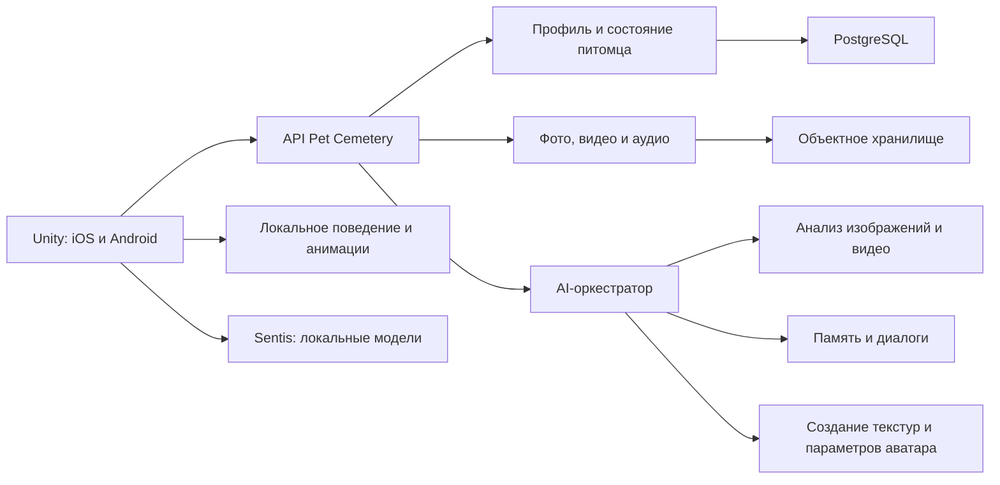

# Виртуальный питомец на Unity и ИИ

## Продуктовая концепция для Pet Cemetery

**Статус:** концепция отдельного клиентского приложения
**Целевая платформа:** iOS и Android
**Технологическая основа:** Unity, сервер Pet Cemetery, облачные и локальные AI-модели

## 1. Краткое описание

Приложение создаёт персонального виртуального питомца на основе фотографий, видео и рассказов пользователя. Питомец получает узнаваемую внешность, характерные привычки, набор воспоминаний и индивидуальное поведение. Пользователь может заботиться о нём, играть, вспоминать реальные события, развивать виртуальное пространство и при желании видеть питомца в дополненной реальности.

Рекомендуемое позиционирование — не «цифровое воскрешение», а **виртуальный хранитель памяти**. Приложение должно честно сообщать, что образ, поведение и реплики являются художественной AI-реконструкцией на основе материалов пользователя.

Ключевая идея продукта:

> Не имитировать сознание питомца, а сохранить его узнаваемый образ, привычки и историю в форме тёплого интерактивного опыта.

## 2. Основные продуктовые режимы

Приложение рекомендуется разделить на два режима, поскольку у владельцев живых и умерших питомцев разные эмоциональные потребности.

| Режим | Для кого | Основная ценность | Особенности |
| --- | --- | --- | --- |
| **Живой питомец** | У пользователя есть реальный питомец | Интерактивный дневник и игровой цифровой двойник | Ежедневные события, развитие, игры, сравнение с реальным питомцем |
| **Питомец-память** | Питомец умер | Бережное сохранение связи и воспоминаний | Спокойное общение, мемориальные сцены, виртуальный сад, отсутствие наказаний за долгий перерыв |

Для режима памяти нельзя буквально копировать механику классического тамагочи. Голод, болезни, смерть и наказания за отсутствие могут усиливать чувство вины. Виртуальный питомец не должен страдать, если пользователь долго не открывал приложение. Он просто спокойно встречает пользователя после возвращения.

## 3. Целевая аудитория

- Владельцы умерших питомцев, желающие сохранить их историю и узнаваемый образ.
- Семьи, которым нужен совместный цифровой альбом и бережный мемориальный опыт.
- Владельцы живых питомцев, ведущие дневник взросления и привычек.
- Пользователи существующей платформы Pet Cemetery, которым нужен более эмоциональный и интерактивный формат мемориала.

## 4. Создание питомца

### 4.1. Материалы пользователя

При создании питомца пользователь может загрузить:

- 5–20 фотографий с разных ракурсов;
- несколько коротких видео с движением и взаимодействием;
- имя, вид, породу, пол и возраст;
- описание окраса и особых внешних признаков;
- рассказы о характере и привычках;
- любимые игрушки, места, еду и занятия;
- памятные даты и события;
- при желании — аудиозаписи и звуки.

### 4.2. «ДНК питомца»

После обработки материалов приложение формирует редактируемый профиль, условно называемый «ДНК питомца».

1. **Внешность:** окрас, пятна, форма головы, ушей, тела, лап, хвоста и глаз.
2. **Характер:** спокойный, ласковый, любопытный, независимый, игривый и другие черты.
3. **Поведение:** походка, любимые позы, реакции, игры и повседневные привычки.
4. **Память:** реальные события, тексты, подписи к фото и подтверждённые факты.
5. **Стиль взаимодействия:** частота активности, отношение к прикосновениям, игрушкам и окружению.

Все выводы ИИ должны показываться пользователю как предложения. Пользователь подтверждает, исправляет или удаляет их до создания окончательного профиля.

## 5. Визуальное представление

### 5.1. Рекомендуемый подход для первой версии

Для MVP не рекомендуется обещать автоматическую фотореалистичную 3D-модель из нескольких фотографий. Такой результат сложно стабилизировать, а небольшие ошибки могут создавать неприятный эффект «зловещей долины».

Более реалистичный подход:

- подготовить качественные базовые модели кошки и собаки;
- использовать набор форм головы, тела, ушей, лап и хвоста;
- определять подходящие параметры по фотографиям;
- генерировать или собирать индивидуальную текстуру шерсти;
- наносить характерные пятна и отметины;
- предоставлять простой ручной редактор результата;
- использовать мягкую стилизацию вместо полного фотореализма.

Узнаваемость должна достигаться не только формой модели, но и сочетанием окраса, поведения, любимых поз, анимаций и реальных воспоминаний.

### 5.2. Возможное развитие

В следующих версиях можно исследовать:

- более точную реконструкцию формы тела по нескольким ракурсам;
- перенос движений из пользовательского видео на 3D-скелет;
- генерацию индивидуальных анимаций;
- создание памятных 3D-диорам по фото и видео;
- более реалистичные режимы отображения как отдельную опцию.

## 6. Основной игровой цикл

Обычный сеанс должен занимать 2–5 минут и не требовать обязательного ежедневного входа.

Пользователь может:

- поприветствовать и погладить питомца;
- поиграть с игрушкой;
- отправиться на короткую виртуальную прогулку;
- открыть фотографию или воспоминание;
- рассказать новую историю;
- добавить привычку или уточнить характер;
- украсить домик, комнату или мемориальный сад;
- сделать совместное фото в AR;
- наблюдать небольшую сцену, основанную на реальной привычке питомца.

Развитие происходит через укрепление связи, а не через давление и страх потери. Постепенно открываются:

- новые анимации и реакции;
- восстановленные эпизоды из истории питомца;
- интерактивная «книга жизни»;
- новые предметы и элементы окружения;
- памятные сцены;
- развитие символического сада или другого мемориального пространства.

## 7. Роль искусственного интеллекта

ИИ следует разделить на несколько специализированных систем. Базовая игровая логика не должна зависеть от одной большой языковой модели.

### 7.1. Анализ фотографий

ИИ может определять:

- вид и предполагаемую породу;
- основные цвета и рисунок шерсти;
- форму ушей, головы, морды и хвоста;
- особые отметины;
- примерные параметры базовой 3D-модели.

Результат используется как черновик для редактора, а не как окончательная истина.

### 7.2. Анализ видео

В первой версии видео можно применять для определения:

- уровня активности;
- характерной походки;
- любимых поз;
- реакции на человека и предметы;
- повторяющихся движений;
- взаимодействия с игрушками.

На следующем этапе возможен перенос отдельных движений на 3D-скелет. Обучение уникальной модели на нескольких коротких видео не должно быть обязательным условием MVP.

### 7.3. Память и характер

Тексты пользователя, подписи к фото и расшифровки видео формируют закрытую базу воспоминаний. Языковая модель получает только релевантные подтверждённые фрагменты и создаёт ответ на их основе.

Допустимый пример:

> Ты рассказывал, что Ричи всегда ждал возле двери, когда слышал ключи.

Недопустимое поведение:

- выдумывать новые события;
- объявлять предположения фактами;
- утверждать, что модель действительно является умершим питомцем;
- использовать манипулятивные реплики о разлуке, вине или оплате;
- говорить от лица питомца без выбранного пользователем сказочного режима.

### 7.4. Поведение питомца

Основная логика поведения должна работать локально как игровая система состояний:

- отдых;
- исследование окружения;
- приглашение к игре;
- реакция на прикосновение;
- взаимодействие с предметом;
- прогулка;
- воспоминание;
- спокойное ожидание.

ИИ может выбирать вариации, контекст и последовательность сцен, но каждое движение не должно требовать облачного запроса. Это уменьшает задержки, стоимость и зависимость от интернета.

### 7.5. Локальные модели

Небольшие модели классификации, распознавания поз или выбора поведения можно запускать непосредственно на устройстве. Unity Sentis предназначен для выполнения обученных нейросетевых моделей внутри Unity-приложения.

Unity AI Assistant, Generators, AI Gateway и MCP в первую очередь ускоряют разработку внутри редактора. Их не следует путать с пользовательской AI-логикой готового приложения.

## 8. Архитектура решения

### 8.1. Unity-клиент

Отвечает за:

- отображение 3D-питомца;
- анимации и локальную систему поведения;
- взаимодействие с окружением;
- локальные уведомления;
- кэширование состояния;
- дополненную реальность;
- доступность и мобильный интерфейс.

### 8.2. Сервер Pet Cemetery

Может оставаться центральной системой для:

- регистрации и авторизации;
- профилей пользователей;
- мемориалов и настроек приватности;
- хранения подтверждённых воспоминаний;
- церемоний и трибьютов;
- синхронизации Unity-питомца с веб-мемориалом;
- экспорта и удаления данных.

Unity-приложение следует развивать как отдельный клиентский продукт и отдельный проект, использующий документированный API. Оно не должно напрямую зависеть от внутренней структуры веб-приложения.

### 8.3. AI-оркестратор

Отвечает за:

- маршрутизацию запросов между моделями;
- извлечение релевантных воспоминаний;
- проверку источников ответа;
- модерацию пользовательских материалов;
- формирование параметров аватара;
- учёт стоимости и лимитов;
- журналирование согласий и версий AI-обработки.

### 8.4. Хранилища

- **PostgreSQL:** пользователи, питомцы, подтверждённые факты, состояние, приватность и связи с мемориалами.
- **Объектное хранилище:** оригинальные фото, видео, аудио, текстуры и производные материалы.
- **Поисковый индекс или векторное хранилище:** смысловой поиск по подтверждённым воспоминаниям.
- **Локальное хранилище устройства:** кэш состояния, настройки и безопасная офлайн-логика.

## 9. Связь с Pet Cemetery

Веб-приложение и Unity-клиент могут использовать единый профиль и мемориал.

Возможные интеграции:

- создание Unity-питомца из существующего мемориала;
- публикация выбранных сцен или фотографий в мемориале;
- переход из публичной страницы к интерактивному опыту;
- использование историй и трибьютов как источников воспоминаний только после разрешения владельца;
- проведение виртуальной церемонии в 3D-пространстве;
- синхронизация настроек приватности между вебом и Unity.

Публичная страница не должна автоматически раскрывать материалы, загруженные для личного AI-питомца.

## 10. Рекомендуемый MVP

### 10.1. Содержание первой версии

- Поддержка кошек и собак.
- Одна качественная стилизованная визуальная тема.
- Создание внешности по фотографиям с ручной коррекцией.
- Настройка окраса, пятен и основных особенностей.
- 10–15 базовых анимаций.
- Небольшая комната, домик или мемориальный сад.
- Поглаживание, игрушка, прогулка, отдых и наблюдение.
- Импорт текстовых воспоминаний.
- AI-лента воспоминаний.
- Ограниченные ответы только на основе материалов пользователя.
- Локальные уведомления без наказаний за отсутствие.
- Синхронизация с мемориалом Pet Cemetery.
- Приватность по умолчанию.
- Удаление и экспорт пользовательских данных.

### 10.2. Приоритет второй версии

- Анализ движений из видео.
- AR-появление питомца в комнате.
- Голосовое взаимодействие.
- Виртуальные прогулки.
- Совместные церемонии.
- Несколько питомцев в одном пространстве.
- Автоматические памятные ролики.
- Сезонные изменения мемориального сада.
- Дополнительные виды животных.

### 10.3. Что не включать в MVP

- Фотореалистичную реконструкцию питомца.
- Обещание полноценной 3D-модели из одной фотографии.
- Бесконечный свободный чат без привязки к источникам.
- Имитацию голоса питомца без отдельного согласия.
- Болезнь или повторную смерть виртуального питомца.
- Наказания за отсутствие пользователя.
- Социальную торговлю питомцами.
- NFT и агрессивные механики удержания.

## 11. Эмоциональная безопасность

Продукт работает с утратой, поэтому его эмоциональная модель является частью функциональных требований.

Обязательные принципы:

- не утверждать, что ИИ является сознанием питомца;
- не создавать чувство вины;
- не использовать угрозу потери прогресса;
- не отправлять манипулятивные уведомления;
- позволять полностью отключить диалоги от лица питомца;
- иметь нейтральный режим наблюдения без разговоров;
- давать возможность скрыть памятные даты и тяжёлые темы;
- ясно маркировать сгенерированные сцены;
- предусмотреть быстрый «тихий режим».

## 12. Приватность и управление данными

- Материалы пользователя не используются для обучения моделей без отдельного явного согласия.
- Приватный режим устанавливается по умолчанию.
- Пользователь выбирает, хранить ли оригинальные видео после анализа.
- Удаление аккаунта охватывает оригиналы и производные AI-данные.
- Должен существовать экспорт фотографий, текстов, подтверждённых фактов и профиля питомца.
- Необходимо выявлять лица детей и посторонних людей в загружаемых материалах.
- Для публичного использования отдельных материалов требуется отдельное разрешение.
- Настройки веб-мемориала и личного Unity-профиля должны быть разделены явно.
- Согласия, версии моделей и история обработки должны фиксироваться сервером.

## 13. Возможная бизнес-модель

Базовый продукт может включать одного питомца, основную среду и ограниченный объём AI-обработки.

Платные возможности:

- дополнительные питомцы;
- расширенные среды и мемориальные сады;
- более детальная обработка фото и видео;
- дополнительные анимации;
- памятные ролики;
- семейный доступ;
- расширенное облачное хранение;
- печатная или цифровая книга жизни.

Не рекомендуется блокировать за оплатой экспорт пользовательских данных, удаление материалов, базовые воспоминания или эмоционально значимые функции после того, как пользователь уже создал мемориал.

## 14. Критерии успеха MVP

MVP можно считать успешным, если:

1. Пользователь создаёт узнаваемого питомца без помощи разработчика.
2. Результат можно исправить через понятный редактор.
3. Поведение работает плавно даже без постоянного подключения к AI-сервису.
4. Все AI-факты прослеживаются до материалов пользователя или помечены как предположение.
5. Режим памяти не содержит механик вины, наказания или повторной потери.
6. Настройки приватности синхронизируются и проверяются сервером.
7. Пользователь может удалить и экспортировать свои материалы.
8. Приложение стабильно работает на целевых устройствах iOS и Android.
9. Созданный питомец связан с мемориалом Pet Cemetery через документированный API.

## 15. Основные риски

| Риск | Последствие | Предлагаемое снижение |
| --- | --- | --- |
| Неточная внешность | Разочарование и эффект «зловещей долины» | Стилизация, базовые модели и обязательный ручной редактор |
| Галлюцинации ИИ | Выдуманные воспоминания | Ответы только по подтверждённым источникам и маркировка предположений |
| Эмоциональная манипуляция | Вред пользователю и потеря доверия | Отказ от наказаний, тихий режим и этический словарь уведомлений |
| Высокая стоимость AI-запросов | Невыгодная экономика продукта | Локальная игровая логика, кэширование и специализированные модели |
| Утечка личных медиа | Критический репутационный и юридический риск | Приватность по умолчанию, шифрование, удаление производных данных |
| Слабая мобильная производительность | Плохой пользовательский опыт | Ограниченный визуальный стиль, профили качества и локальные бюджеты |
| Слишком широкий MVP | Долгая разработка без проверки спроса | Один стиль, кошки и собаки, ограниченный набор действий |

## 16. Открытые продуктовые решения

Перед переходом к проектированию MVP необходимо определить:

1. Какой режим запускается первым: живой питомец, питомец-память или оба сразу.
2. Насколько стилизованной должна быть графика.
3. Какие виды животных входят в первую версию.
4. Допускаются ли реплики от первого лица в сказочном режиме.
5. Какие материалы хранятся после AI-анализа.
6. Какие возможности работают офлайн.
7. Какой минимальный набор API должен предоставить Pet Cemetery.
8. Нужна ли AR-функция уже в MVP.
9. Планируется ли семейный совместный доступ.
10. Где проходит граница между бесплатной и платной версиями.

## 17. Рекомендуемое направление

Начать со **стилизованного виртуального питомца-памяти**, где узнаваемость создаётся сочетанием окраса, внешних особенностей, настоящих привычек, характерных анимаций и подтверждённых историй.

Это направление:

- реалистичнее для первой версии;
- эмоционально безопаснее фотореалистичной имитации;
- технологически проще контролировать;
- естественно дополняет существующий Pet Cemetery;
- позволяет постепенно добавлять анализ видео, AR и более сложные AI-функции.

## 18. Источники и технические ориентиры

- [Unity AI: официальная документация](https://docs.unity.com/en-us/ai)
- [Unity AI tools: официальный обзор открытой беты](https://unity.com/blog/unity-ai-how-to-get-started)
- [Unity AR Foundation](https://docs.unity3d.com/ja/current/Manual/com.unity.xr.arfoundation.html)
- [Unity XR Manual](https://docs.unity3d.com/6000.1/Documentation/Manual/XR.html)

Источники подтверждают актуальные возможности Unity для разработки, локального запуска моделей и кроссплатформенного AR. Конкретные AI-провайдеры, модели, стоимость и серверная схема должны выбираться отдельно после утверждения продуктового MVP.
